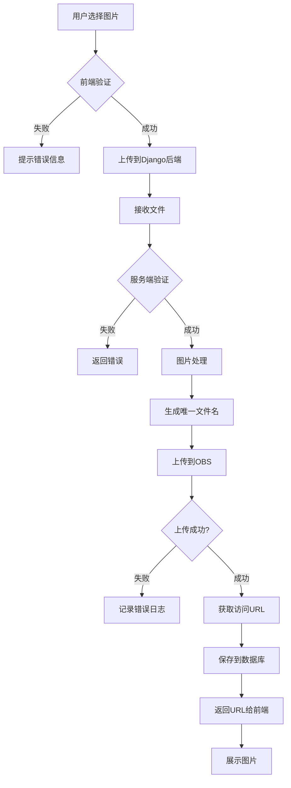

# 华为云OBS图片上传存储和使用完整流程

## 目录
- [1. 概述](#1-概述)
- [2. 准备工作](#2-准备工作)
- [3. 技术架构](#3-技术架构)
- [4. 实现流程](#4-实现流程)
- [5. 代码实现](#5-代码实现)
- [6. 使用示例](#6-使用示例)
- [7. 最佳实践](#7-最佳实践)
- [8. 常见问题](#8-常见问题)

---

## 1. 概述

### 1.1 什么是华为云OBS
华为云对象存储服务（Object Storage Service，简称OBS）是一个基于对象的海量存储服务，为用户提供海量、安全、高可靠、低成本的数据存储能力。

### 1.2 应用场景
- 用户头像存储
- 活动图片上传
- 商户图片管理
- 静态资源托管
- 文件备份存储

### 1.3 核心优势
- ✅ **高可靠**：99.9999999999%（12个9）的数据持久性
- ✅ **高性能**：支持高并发访问
- ✅ **低成本**：按需付费，成本可控
- ✅ **安全性**：支持加密存储和访问控制
- ✅ **易扩展**：无需担心容量限制

---

## 2. 准备工作

### 2.1 华为云账号准备
1. 注册华为云账号：https://www.huaweicloud.com/
2. 完成实名认证
3. 开通OBS服务

### 2.2 创建OBS存储桶
```bash
# 登录华为云控制台
1. 进入对象存储服务OBS
2. 点击"创建桶"
3. 配置以下信息：
   - 桶名称：clubengine-images（全局唯一）
   - 区域：华北-北京四（cn-north-4）
   - 存储类别：标准存储
   - 桶策略：私有（推荐）或公共读
   - 数据冗余存储策略：多AZ存储
```

### 2.3 获取访问密钥
```bash
# 在华为云控制台
1. 点击右上角用户名 -> 我的凭证
2. 访问密钥 -> 新增访问密钥
3. 保存以下信息：
   - Access Key ID (AK)
   - Secret Access Key (SK)
```

### 2.4 安装依赖库
```bash
# 安装华为云OBS SDK
pip install esdk-obs-python

# 或添加到 requirements.txt
esdk-obs-python>=3.23.3
Pillow>=10.0.0  # 图片处理库
```

---

## 3. 技术架构

### 3.1 整体架构图
```
┌─────────────┐      ┌──────────────┐      ┌─────────────┐
│   前端页面   │ ───> │  Django后端   │ ───> │  华为云OBS  │
│  (上传界面) │ <─── │ (图片处理)   │ <─── │  (存储桶)   │
└─────────────┘      └──────────────┘      └─────────────┘
                            │
                            ▼
                     ┌──────────────┐
                     │   MySQL DB    │
                     │ (URL记录)    │
                     └──────────────┘
```

### 3.2 数据流向
```
1. 用户选择图片 → 前端验证（大小、格式）
2. 前端上传 → Django接收文件
3. Django处理 → 图片压缩/格式转换/生成唯一文件名
4. OBS上传 → 调用OBS SDK上传到云端
5. 保存记录 → 将OBS URL存入数据库
6. 返回URL → 前端展示图片
```

### 3.3 目录结构
```
ClubEngine/
├── util/
│   ├── obs_helper.py          # OBS工具类
│   └── image_processor.py     # 图片处理工具
├── config/
│   └── obs_config.py          # OBS配置
└── api/
    └── upload_view.py         # 上传接口
```

---

## 4. 实现流程

### 4.1 流程图


### 4.2 详细步骤

#### 步骤1：前端上传
```javascript
// HTML
<input type="file" id="imageUpload" accept="image/*" />

// JavaScript
document.getElementById('imageUpload').addEventListener('change', async (e) => {
    const file = e.target.files[0];
    
    // 1. 前端验证
    if (!validateImage(file)) {
        alert('图片格式或大小不符合要求');
        return;
    }
    
    // 2. 创建FormData
    const formData = new FormData();
    formData.append('image', file);
    formData.append('type', 'avatar'); // 图片类型
    
    // 3. 上传
    const response = await fetch('/api/upload/image', {
        method: 'POST',
        headers: {
            'Authorization': 'Bearer ' + token
        },
        body: formData
    });
    
    const result = await response.json();
    if (result.code === 200) {
        // 4. 显示图片
        document.getElementById('preview').src = result.data.url;
    }
});

function validateImage(file) {
    // 验证文件类型
    const allowedTypes = ['image/jpeg', 'image/png', 'image/jpg', 'image/gif'];
    if (!allowedTypes.includes(file.type)) {
        return false;
    }
    
    // 验证文件大小（5MB）
    const maxSize = 5 * 1024 * 1024;
    if (file.size > maxSize) {
        return false;
    }
    
    return true;
}
```

#### 步骤2：Django后端接收
```python
# views.py
from django.views.decorators.csrf import csrf_exempt
from django.http import JsonResponse
from util.obs_helper import OBSHelper
from util.image_processor import ImageProcessor

@csrf_exempt
def upload_image(request):
    if request.method != 'POST':
        return JsonResponse({'code': 405, 'message': '方法不允许'})
    
    # 1. 获取上传的文件
    image_file = request.FILES.get('image')
    image_type = request.POST.get('type', 'general')
    
    if not image_file:
        return JsonResponse({'code': 400, 'message': '未找到图片文件'})
    
    try:
        # 2. 验证文件
        if not validate_image(image_file):
            return JsonResponse({'code': 400, 'message': '图片格式或大小不符合要求'})
        
        # 3. 处理图片（压缩、转换格式等）
        processor = ImageProcessor()
        processed_image = processor.process(image_file, image_type)
        
        # 4. 上传到OBS
        obs_helper = OBSHelper()
        result = obs_helper.upload_image(processed_image, image_type)
        
        if result['success']:
            # 5. 保存记录到数据库
            save_image_record(request.user.id, result['url'], image_type)
            
            return JsonResponse({
                'code': 200,
                'message': '上传成功',
                'data': {
                    'url': result['url'],
                    'cdn_url': result['cdn_url']
                }
            })
        else:
            return JsonResponse({'code': 500, 'message': '上传失败'})
            
    except Exception as e:
        logger.error(f'上传图片失败: {str(e)}')
        return JsonResponse({'code': 500, 'message': '服务器错误'})
```

#### 步骤3：图片上传到OBS
```python
# 通过OBS SDK上传
obs_client.putObject(
    bucketName='clubengine-images',
    objectKey='avatar/2026/01/03/uuid-xxx.jpg',
    file_path='/tmp/processed_image.jpg'
)
```

#### 步骤4：返回URL
```python
# 公共读URL
url = f"https://clubengine-images.obs.cn-north-4.myhuaweicloud.com/avatar/2026/01/03/uuid-xxx.jpg"

# 或使用CDN加速URL
cdn_url = f"https://cdn.example.com/avatar/2026/01/03/uuid-xxx.jpg"
```

---

## 5. 代码实现

### 5.1 配置文件
```python
# config/obs_config.py
"""
华为云OBS配置
"""

# OBS基础配置
OBS_CONFIG = {
    # 访问密钥
    'access_key_id': 'YOUR_ACCESS_KEY_ID',
    'secret_access_key': 'YOUR_SECRET_ACCESS_KEY',
    
    # 服务器地址
    'server': 'https://obs.cn-north-4.myhuaweicloud.com',
    
    # 存储桶名称
    'bucket_name': 'clubengine-images',
    
    # 区域
    'region': 'cn-north-4',
    
    # 签名版本（推荐使用v4）
    'signature': 'v4'
}

# 上传配置
UPLOAD_CONFIG = {
    # 允许的图片格式
    'allowed_formats': ['jpg', 'jpeg', 'png', 'gif', 'webp'],
    
    # 最大文件大小（字节）
    'max_size': 5 * 1024 * 1024,  # 5MB
    
    # 图片质量（压缩后）
    'quality': 85,
    
    # 缩略图尺寸
    'thumbnail_size': (200, 200),
    
    # 是否生成缩略图
    'generate_thumbnail': True,
}

# 目录结构配置
DIRECTORY_CONFIG = {
    'avatar': 'avatar/{year}/{month}/{day}/',      # 用户头像
    'activity': 'activity/{year}/{month}/{day}/',  # 活动图片
    'merchant': 'merchant/{year}/{month}/{day}/',  # 商户图片
    'general': 'general/{year}/{month}/{day}/',    # 通用图片
}

# CDN配置（可选）
CDN_CONFIG = {
    'enabled': True,
    'domain': 'https://cdn.example.com',
}
```

### 5.2 OBS工具类

代码文件已创建在 `util/obs_helper.py`，主要功能包括：
- 初始化OBS客户端
- 生成对象存储路径
- 上传文件到OBS
- 删除OBS文件
- 生成临时访问URL
- 获取CDN加速URL

### 5.3 图片处理工具类

代码文件已创建在 `util/image_processor.py`，主要功能包括：
- 验证图片文件
- 压缩图片
- 调整图片尺寸
- 创建缩略图
- 裁剪为正方形
- 添加水印

### 5.4 上传接口视图

代码文件已创建在 `util/upload_views.py`，提供的接口：
- `POST /api/upload/image` - 通用图片上传
- `POST /api/upload/avatar` - 用户头像上传
- `POST /api/delete/image` - 删除图片

---

## 6. 使用示例

### 6.1 Django Settings配置

在 `settings.py` 中添加OBS配置：

```python
# settings.py

# 华为云OBS配置
OBS_ACCESS_KEY_ID = 'YOUR_ACCESS_KEY_ID'
OBS_SECRET_ACCESS_KEY = 'YOUR_SECRET_ACCESS_KEY'
OBS_SERVER = 'https://obs.cn-north-4.myhuaweicloud.com'
OBS_BUCKET_NAME = 'clubengine-images'
OBS_REGION = 'cn-north-4'

# CDN配置（可选）
OBS_CDN_DOMAIN = 'https://cdn.yourdomain.com'  # 如果配置了CDN
```

### 6.2 配置URL路由

在 `urls.py` 中添加上传接口路由：

```python
# ClubEngine/urls.py
from django.urls import path
from util.upload_views import upload_image, upload_avatar, delete_image

urlpatterns = [
    # ...existing patterns...
    
    # 图片上传接口
    path('api/upload/image', upload_image, name='upload_image'),
    path('api/upload/avatar', upload_avatar, name='upload_avatar'),
    path('api/delete/image', delete_image, name='delete_image'),
]
```

### 6.3 在视图中使用

**示例1：用户头像上传**

```python
from util.obs_helper import OBSHelper
from util.image_processor import ImageProcessor

def update_user_avatar(request):
    """更新用户头像"""
    user_id = request.POST.get('uid')
    image_file = request.FILES.get('avatar')
    
    if not image_file:
        return JsonResponse({'code': 400, 'message': '未找到图片'})
    
    try:
        # 1. 处理图片
        processor = ImageProcessor()
        is_valid, msg = processor.validate_image(image_file)
        if not is_valid:
            return JsonResponse({'code': 400, 'message': msg})
        
        image_file.seek(0)
        processed_data = processor.process(image_file, 'avatar')
        
        # 2. 上传到OBS
        obs_helper = OBSHelper()
        result = obs_helper.upload_image(processed_data, 'avatar', image_file.name)
        
        if result['success']:
            # 3. 更新数据库
            UserInforTable.objects.filter(uid=user_id).update(
                pic=result.get('cdn_url', result['url'])
            )
            
            return JsonResponse({
                'code': 200,
                'message': '上传成功',
                'data': {'url': result['url']}
            })
    except Exception as e:
        logger.error(f'上传失败: {str(e)}')
        return JsonResponse({'code': 500, 'message': '服务器错误'})
```

**示例2：活动图片上传**

```python
def upload_activity_image(request):
    """上传活动图片"""
    image_file = request.FILES.get('image')
    activity_id = request.POST.get('act_id')
    
    processor = ImageProcessor()
    processed_data = processor.process(image_file, 'activity')
    
    obs_helper = OBSHelper()
    result = obs_helper.upload_image(processed_data, 'activity', image_file.name)
    
    if result['success']:
        # 保存到活动表
        ActivityInfoTable.objects.filter(act_id=activity_id).update(
            img_url=result['url']
        )
        return JsonResponse({'code': 200, 'data': result})
```

**示例3：批量上传**

```python
def batch_upload_images(request):
    """批量上传图片"""
    images = request.FILES.getlist('images')
    image_type = request.POST.get('type', 'general')
    
    results = []
    obs_helper = OBSHelper()
    processor = ImageProcessor()
    
    for image_file in images:
        try:
            is_valid, msg = processor.validate_image(image_file)
            if not is_valid:
                results.append({'filename': image_file.name, 'success': False, 'message': msg})
                continue
            
            image_file.seek(0)
            processed_data = processor.process(image_file, image_type)
            result = obs_helper.upload_image(processed_data, image_type, image_file.name)
            
            results.append({
                'filename': image_file.name,
                'success': result['success'],
                'url': result.get('url', ''),
                'message': result.get('message', '')
            })
        except Exception as e:
            results.append({'filename': image_file.name, 'success': False, 'message': str(e)})
    
    return JsonResponse({'code': 200, 'data': results})
```

**示例4：删除图片**

```python
def delete_user_avatar(user_id):
    """删除用户旧头像"""
    user = UserInforTable.objects.filter(uid=user_id).first()
    if user and user.pic:
        # 从URL提取object_key
        url = user.pic
        if 'obs.cn-north-4.myhuaweicloud.com' in url:
            object_key = url.split('.com/')[-1]
            
            obs_helper = OBSHelper()
            result = obs_helper.delete_file(object_key)
            
            if result['success']:
                logger.info(f'删除用户{user_id}旧头像成功')
```

### 6.4 生成临时访问URL（私有桶）

如果存储桶设置为私有，需要生成临时访问URL：

```python
from util.obs_helper import OBSHelper

def get_private_image_url(object_key, expires=3600):
    """获取私有图片的临时访问URL"""
    obs_helper = OBSHelper()
    result = obs_helper.get_signed_url(object_key, expires)
    
    if result['success']:
        return result['url']
    else:
        return None

# 使用示例
object_key = 'avatar/2026/01/03/uuid-xxx.jpg'
temp_url = get_private_image_url(object_key, expires=7200)  # 2小时有效
```

---

## 7. 最佳实践

### 7.1 安全性

1. **密钥安全**
   - 不要在代码中硬编码访问密钥
   - 使用环境变量或配置文件
   - 定期轮换访问密钥

```python
# 推荐：使用环境变量
import os
OBS_ACCESS_KEY_ID = os.getenv('OBS_ACCESS_KEY_ID')
OBS_SECRET_ACCESS_KEY = os.getenv('OBS_SECRET_ACCESS_KEY')
```

2. **桶策略**
   - 生产环境推荐使用私有桶
   - 配置防盗链
   - 启用访问日志

3. **文件验证**
   - 严格验证文件类型和大小
   - 检查文件内容（防止伪造后缀名）
   - 使用白名单而非黑名单

### 7.2 性能优化

1. **图片压缩**
   - 上传前自动压缩图片
   - 根据场景调整质量参数
   - 转换为WebP格式（现代浏览器）

```python
# 根据图片大小动态调整质量
def get_quality_by_size(image_size):
    if image_size > 2 * 1024 * 1024:  # > 2MB
        return 75
    elif image_size > 1 * 1024 * 1024:  # > 1MB
        return 80
    else:
        return 85
```

2. **CDN加速**
   - 配置华为云CDN
   - 设置缓存策略
   - 使用CDN域名访问

3. **懒加载**
   - 前端实现图片懒加载
   - 使用缩略图预览
   - 大图按需加载

### 7.3 目录结构规范

```
clubengine-images/
├── avatar/              # 用户头像
│   ├── 2026/
│   │   ├── 01/
│   │   │   ├── 01/
│   │   │   ├── 02/
│   │   │   └── 03/
│   │   └── 02/
├── activity/            # 活动图片
│   ├── 2026/
│   │   └── 01/
├── merchant/            # 商户图片
│   └── 2026/
└── general/             # 通用图片
    └── 2026/
```

### 7.4 错误处理

```python
import logging
from django.http import JsonResponse

logger = logging.getLogger(__name__)

def safe_upload(image_file, image_type):
    """安全的图片上传，包含完整错误处理"""
    try:
        # 1. 验证
        processor = ImageProcessor()
        is_valid, msg = processor.validate_image(image_file)
        if not is_valid:
            logger.warning(f'图片验证失败: {msg}')
            return {'success': False, 'message': msg}
        
        # 2. 处理
        image_file.seek(0)
        processed_data = processor.process(image_file, image_type)
        
        # 3. 上传
        obs_helper = OBSHelper()
        result = obs_helper.upload_image(processed_data, image_type, image_file.name)
        
        if result['success']:
            logger.info(f'图片上传成功: {result["object_key"]}')
        else:
            logger.error(f'图片上传失败: {result.get("message")}')
        
        return result
        
    except Exception as e:
        logger.error(f'上传过程异常: {str(e)}', exc_info=True)
        return {'success': False, 'message': f'上传异常: {str(e)}'}
```

### 7.5 数据库记录

建议创建图片记录表：

```python
# models.py
from django.db import models

class ImageRecord(models.Model):
    """图片记录表"""
    id = models.AutoField(primary_key=True)
    user_id = models.CharField(max_length=100, verbose_name='用户ID')
    image_type = models.CharField(max_length=50, verbose_name='图片类型')
    object_key = models.CharField(max_length=500, verbose_name='OBS对象Key')
    url = models.CharField(max长度=1000, verbose名='访问URL')
    cdn_url = models.CharField(max长度=1000, verbose名='CDN URL', null=True)
    file_size = models.IntegerField(verbose名='文件大小(字节)')
    upload_time = models.DateTimeField(auto_now_add=True, verbose名='上传时间')
    is_deleted = models.BooleanField(default=False, verbose名='是否删除')
    
    class Meta:
        db_table = 'image_record'
        verbose_name = '图片记录'
```

### 7.6 监控与日志

```python
# 记录上传统计
def log_upload_stats(user_id, image_type, file_size, success):
    """记录上传统计"""
    logger.info(f'''
    上传统计:
    - 用户ID: {user_id}
    - 图片类型: {image_type}
    - 文件大小: {file_size} bytes
    - 是否成功: {success}
    - 时间: {datetime.now()}
    ''')

# 监控上传失败
def monitor_upload_failures():
    """监控上传失败情况"""
    # 可以配合监控系统（如Prometheus）
    pass
```

---

## 8. 常见问题

### 8.1 上传失败

**问题1：签名错误**
```
错误信息：SignatureDoesNotMatch
解决方案：
1. 检查Access Key和Secret Key是否正确
2. 确认时间同步（服务器时间与标准时间差不超过15分钟）
3. 检查签名版本配置
```

**问题2：权限不足**
```
错误信息：AccessDenied
解决方案：
1. 检查IAM用户权限
2. 确认桶策略配置
3. 验证跨域配置（CORS）
```

**问题3：桶不存在**
```
错误信息：NoSuchBucket
解决方案：
1. 检查桶名称是否正确
2. 确认区域配置是否匹配
3. 验证桶是否已创建
```

### 8.2 图片处理问题

**问题1：内存溢出**
```python
# 处理大图片时可能内存不足
# 解决方案：分块处理或限制图片大小
MAX_IMAGE_SIZE = 10 * 1024 * 1024  # 限制10MB

if image_file.size > MAX_IMAGE_SIZE:
    return {'success': False, 'message': '图片过大'}
```

**问题2：格式不支持**
```python
# 某些特殊格式可能无法处理
# 解决方案：转换为常见格式
try:
    image = Image.open(image_file)
    if image.format not in ['JPEG', 'PNG', 'GIF']:
        # 转换为JPEG
        rgb_image = image.convert('RGB')
        output = io.BytesIO()
        rgb_image.save(output, format='JPEG')
        processed_data = output.getvalue()
except Exception as e:
    logger.error(f'图片格式转换失败: {str(e)}')
```

### 8.3 网络问题

**问题：上传超时**
```python
# 解决方案：配置超时时间和重试机制
from obs import ObsClient

obs_client = ObsClient(
    access_key_id=access_key_id,
    secret_access_key=secret_access_key,
    server=server,
    timeout=300,  # 超时时间（秒）
    max_retry_count=3  # 最大重试次数
)
```

### 8.4 URL访问问题

**问题：图片无法访问（403/404）**
```
解决方案：
1. 公共读桶：检查桶策略是否设置为公共读
2. 私有桶：使用临时URL访问
3. 检查防盗链配置
4. 验证CDN配置
```

### 8.5 成本优化

**建议：**
1. 定期清理过期图片
2. 使用生命周期规则自动删除
3. 选择合适的存储类别（标准/低频/归档）
4. 启用智能分层存储

```python
# 清理30天前的临时图片
def clean_old_temp_images():
    """清理旧的临时图片"""
    from datetime import datetime, timedelta
    
    obs_helper = OBSHelper()
    thirty_days_ago = datetime.now() - timedelta(days=30)
    
    # 列出对象
    result = obs_helper.list_objects(prefix='general/')
    
    if result['success']:
        for obj in result['objects']:
            if obj['last_modified'] < thirty_days_ago:
                obs_helper.delete_file(obj['key'])
                logger.info(f'清理旧图片: {obj["key"]}')
```

### 8.6 调试技巧

```python
# 开启OBS SDK调试日志
import logging

# 设置OBS日志级别
logging.basicConfig(level=logging.DEBUG)
obs_logger = logging.getLogger('obs')
obs_logger.setLevel(logging.DEBUG)

# 测试连接
def test_obs_connection():
    """测试OBS连接"""
    try:
        obs_helper = OBSHelper()
        result = obs_helper.list_objects(max_keys=1)
        
        if result['success']:
            print('✅ OBS连接成功')
            return True
        else:
            print(f'❌ OBS连接失败: {result.get("message")}')
            return False
    except Exception as e:
        print(f'❌ OBS连接异常: {str(e)}')
        return False
```

---

## 9. 总结

### 9.1 核心流程回顾

```
用户上传 → 前端验证 → 后端接收 → 图片处理 → OBS存储 → 数据库记录 → 返回URL
```

### 9.2 关键代码文件

- `util/obs_helper.py` - OBS操作工具类
- `util/image_processor.py` - 图片处理工具类
- `util/upload_views.py` - 上传接口视图
- `settings.py` - OBS配置

### 9.3 注意事项

1. ⚠️ **安全**：不要泄露访问密钥
2. ⚠️ **性能**：大图片要压缩处理
3. ⚠️ **成本**：定期清理无用图片
4. ⚠️ **备份**：重要图片要做备份
5. ⚠️ **监控**：关注上传成功率和失败原因

### 9.4 扩展阅读

- [华为云OBS官方文档](https://support.huaweicloud.com/obs/index.html)
- [OBS Python SDK文档](https://support.huaweicloud.com/sdk-python-devg-obs/obs_22_0100.html)
- [OBS最佳实践](https://support.huaweicloud.com/bestpractice-obs/obs_05_0000.html)

---

**文档版本**: v1.0  
**最后更新**: 2026年1月3日  
**维护者**: ClubEngine Team

